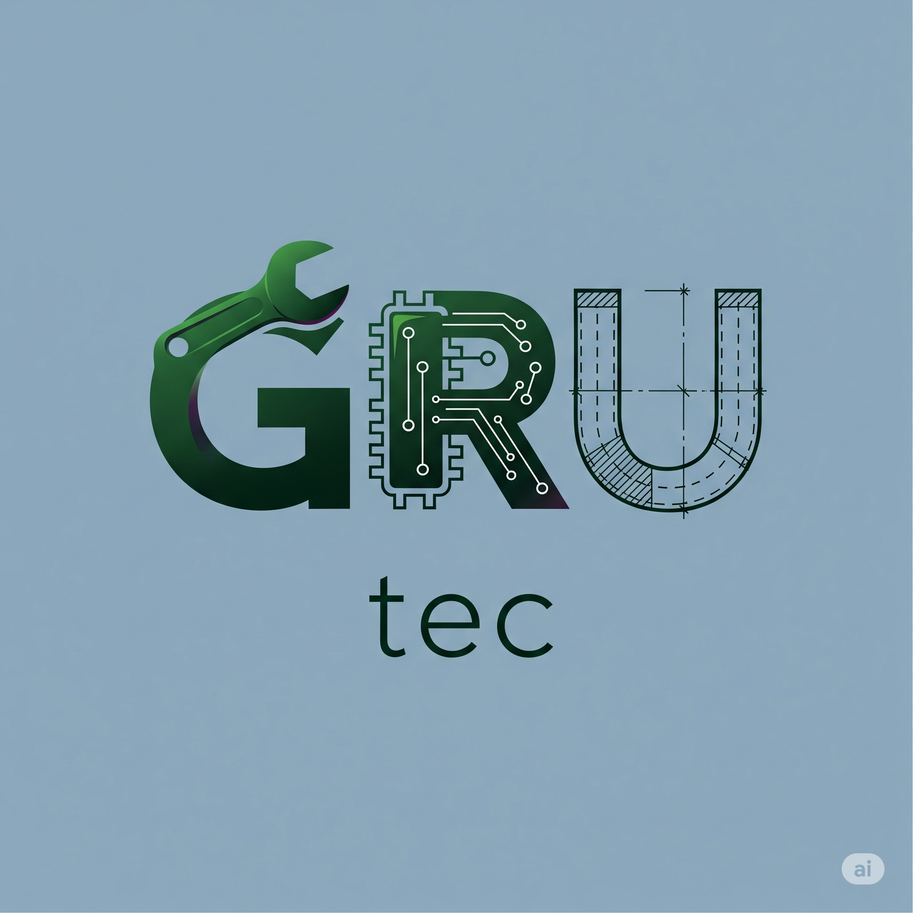
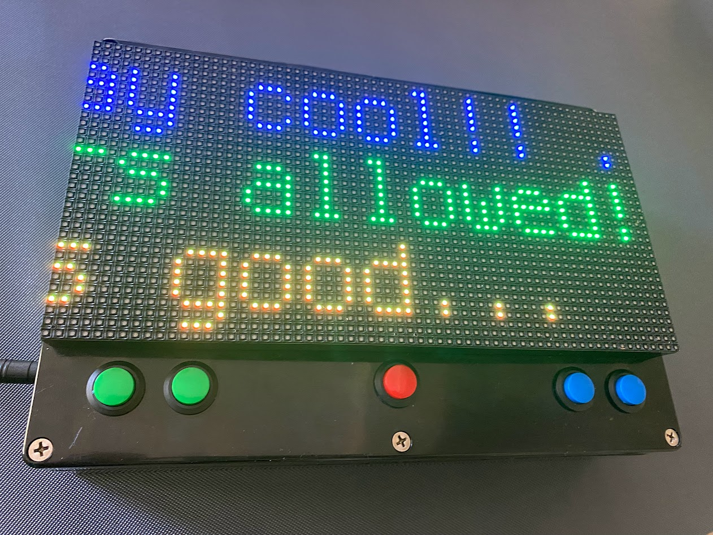
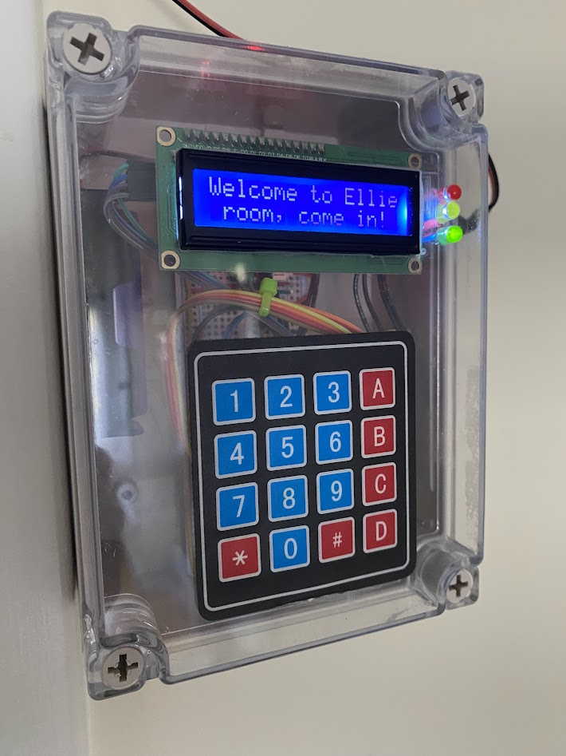
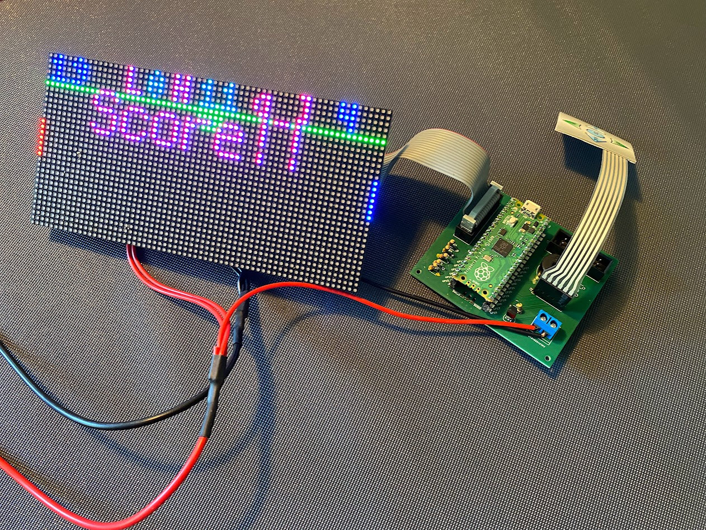

## Overview

GRU is a compony that me and my dad founded and we build electronics and we are proud to present you what we have built. This website is all about showing what we have created and you can possibly buy what we have built (only if you like it)!

---

## Products 
In this section you can see what our latest builds are and so far we have built a GRU gaming computer and a sibling alarm (that will alert you when your sibling is coming into your room).

### GRU game computer

Currently supported games:

 * Pong
 * Snake
 * Scrolling sign
 * more to come!

---

### GRU Sibling Alarm

This alarm will keep annoying siblings out of your room!

---

## Who we are
Ellie Founder, CEO

---

Robert Founder, CTO

## Projects in development

### GRU Game Computer Mini

This smaller version of the GRU Game Computer needs a casing; we're hiring people with 3D printers!

---

### Smart plant pot

 * Will tell you when plant needs sun, water or food
 * Automatic watering?

